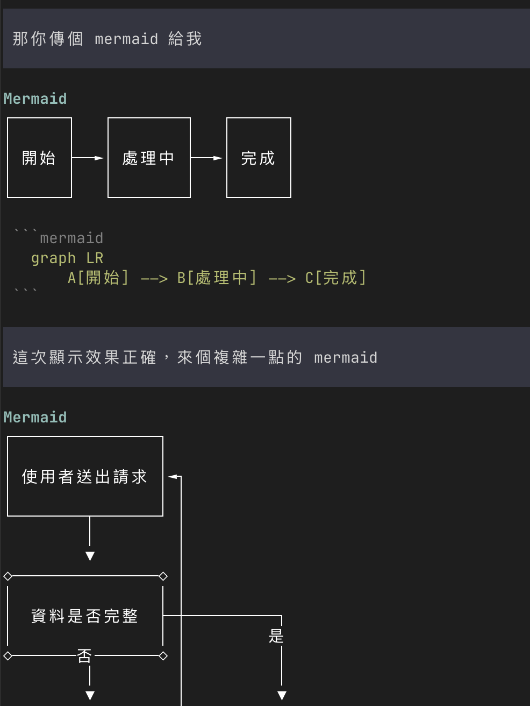
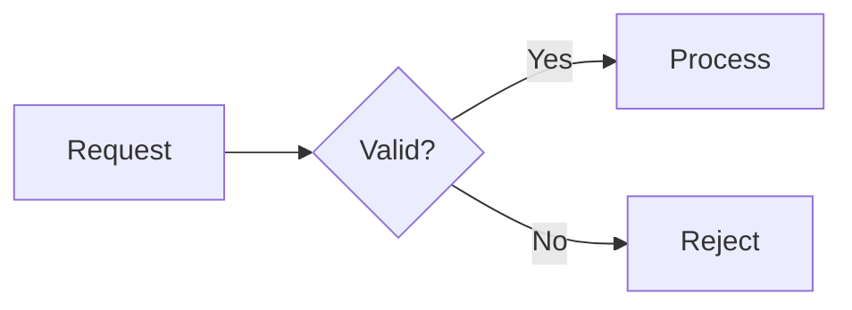

# pi-mermaid

A [pi](https://github.com/earendil-works/pi) extension that renders Mermaid diagrams as Unicode art directly in the terminal.



## Features

- Automatically renders `mermaid` fenced blocks from assistant responses
- `/mermaid` slash command for quick diagrams
- `render_mermaid` tool the model can call
- Unicode box drawing by default, with pure ASCII support through the tool
- Diagram source remains visible when tool output is expanded
- No browser, Chromium, DOM, or external Mermaid CLI required

Supported by the underlying renderer: flowcharts, state diagrams, sequence diagrams, class diagrams, ER diagrams, and XY charts.

## Install

From npm after publication:

```sh
pi install npm:@geminixiang/pi-mermaid
```

From this checkout:

```sh
npm install
pi install .
```

For development without installing the package:

```sh
npm install
pi -e ./extensions/mermaid.ts
```

If installed as a project-local package, restart pi or use `/reload` after editing the extension.

## Usage

Ask pi for a Mermaid diagram, or include a fenced block in its response:

````markdown

````

The extension appends the rendered terminal diagram immediately below the response.

Render one directly:

```text
/mermaid graph LR; A[Request] --> B[Response]
```

The model can also invoke `render_mermaid` with:

```json
{
  "source": "graph LR; A --> B",
  "ascii": false
}
```

## Development

```sh
npm install
npm test
npm run check
```

## Notes

- Very wide diagrams are clipped to the terminal width. Prefer top-to-bottom layouts (`graph TD`) or smaller diagrams when space is limited.
- Rendering is powered by [`beautiful-mermaid`](https://github.com/lukilabs/beautiful-mermaid).
